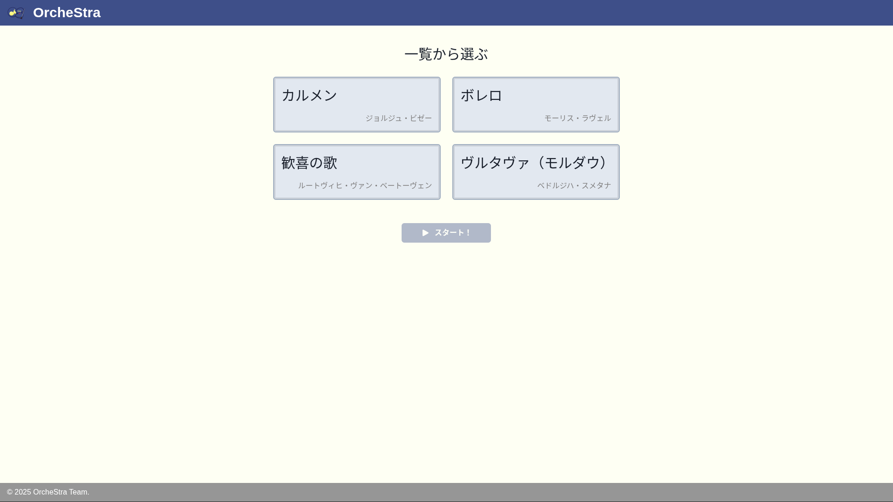
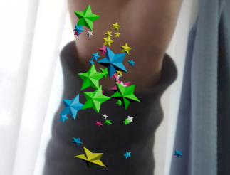
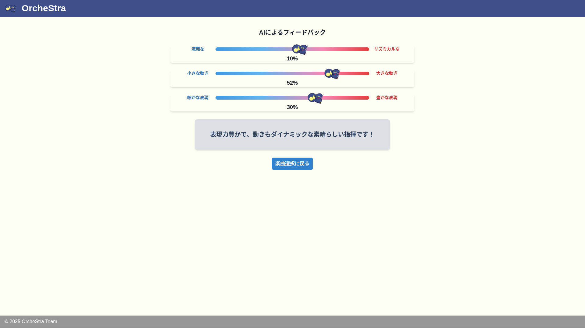

# orchestra-app
## 概要
第36回全国高等専門学校プログラミングコンテスト 自由部門 応募作品 OrcheStraのWebアプリケーションです。\
このWebアプリケーションでは、カメラの前で体を自由に動かすことで、聴覚的・視覚的に楽曲を変化させ、演奏を行うことができます。
演奏後、体の動きから演奏に対してAIがフィードバックをしてくれます。

## 機能
### 演奏楽曲選択機能
1. 演奏可能な楽曲一覧から、楽曲を1つ選択する\
2. 「スタート」ボタンを押すことで、楽曲演奏ページへと遷移する


### 楽曲演奏機能
1. カメラの選択を行う
2. 指揮棒を持ち、カメラの前で指揮を行う
3. 指揮の仕方によって楽曲や画面に変化が生じる
    - 指揮棒デバイスを振る速度に応じて、楽曲の再生速度が変化する(※指揮棒デバイス接続時のみ)
    - 腕を振る大きさに応じて、楽曲の音量が変化する
    - 腕の動きに合わせて画面上に星型のエフェクトが表示される

    

### AIフィードバック機能
楽曲演奏での指揮の動きに対して、AIが評価を行う



## アプリのセットアップ
1. Raspberry Pi Zero上で[指揮棒デバイス用プログラム](https://github.com/OrcheStra-procon2025/OrcheStra-device)を実行し、Web Socket Serverを起動する
2. 楽曲選択画面でRaspberry Pi ZeroとWeb Socket接続を行う


## 開発者向け

### moduleのinstall
```
npm install
```

### local server起動
```
npm run dev
```

### フォーマッタ・リンタの使用
PRレビューを出す前に必ず使用する
- フォーマッタ
```
npm run fmt
```

- リンタ
```
npm run lint
```