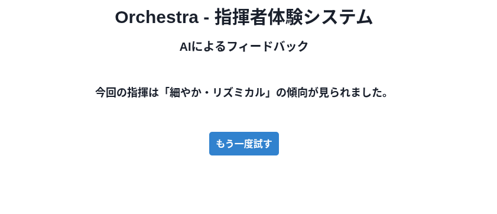

# orchestra-app


## 機能
### 演奏楽曲選択機能
演奏可能な楽曲一覧から、楽曲を1つ選択する。\
その後、「スタート」ボタンを押すことで、楽曲演奏ページへと遷移する。


### 楽曲演奏機能
楽曲の演奏を行う。
1. カメラの選択、指揮棒デバイスとのWebSocket接続を行う
2. 指揮棒を持ち、カメラの前で指揮を行う
3. 腕の動きに合わせて画面上に星型のエフェクトが表示される

### AIフィードバック機能
楽曲演奏での指揮の動きに対して、AIが評価を行う


## 開発者向け

### moduleのinstall
```
npm install
```

### local server起動
```
npm run dev
```

### フォーマッタ・リンタの使用
PRレビューを出す前に必ず使用する
- フォーマッタ
```
npm run fmt
```

- リンタ
```
npm run lint
```